# Design Document: Mobile Performance Optimization

## Overview

This feature optimizes the Laravel + Inertia.js + React 19 + TypeScript SPA for mobile performance and accessibility. The application currently suffers from eager-loaded heavy 3D libraries, duplicated PerformanceObserver instances, expensive CSS paint operations on mobile, touch-unfriendly interactions, and several layout bugs on small screens.

The optimization strategy follows three axes:

1. **Bundle reduction** — remove Three.js from the critical path via dynamic imports and a dedicated chunk
2. **Runtime cost reduction** — skip or simplify expensive animations/effects on touch/mobile devices
3. **Layout correctness** — fix overflow clipping, spacing, and tap-target issues on small screens

No new dependencies are introduced. All changes are surgical modifications to existing files.

## Architecture

The changes span the build pipeline, the application bootstrap, and individual UI components. They are independent of each other and can be shipped incrementally.

```mermaid
graph TD
    A[vite.config.ts] -->|chunk splitting| B[three-vendor chunk]
    C[app.tsx] -->|deferred init| D[ScrollTrigger on scroll]
    C -->|single location| E[PerformanceObserver]
    F[app.blade.php] -->|consolidated fonts| G[≤2 families, display=swap]
    H[MainLayout.tsx] -->|remove inline script| E
    H -->|overflow-x-hidden| I[no vertical clip]
    J[GlobalWatercolorBackground] -->|mobile blur ≤60px| K[contain:paint]
    L[Navigation] -->|skip magnetic on touch| M[matchMedia once]
    N[FloatingSocials] -->|hidden <640px| O[no Framer on touch]
    P[AnimatedSection] -->|no aria-hidden| Q[will-change:auto after]
    R[HeroSection] -->|fluid type, skip parallax| S[60s marquee mobile]
    T[ServicesSection] -->|no translate mobile| U[touch-action:manipulation]
    V[FeaturedProjects] -->|gap-12 mobile| W[non-sticky sidebar]
    X[StatsSection] -->|py-16 mobile| Y[min-h-200px]
    Z[PageTransition] -->|skip AnimatePresence reduced-motion| AA[150ms mobile]
    AB[app.css] -->|global touch-action| U
```



## Components and Interfaces

### vite.config.ts

Remove `three`, `@react-three/fiber`, `@react-three/drei` from `optimizeDeps.include`. Add a `three-vendor` branch to `manualChunks`:

```ts
if (id.includes('three') || id.includes('@react-three')) return 'three-vendor';
```

### Globe3DBlock (dynamic import)

Wherever `Globe3DBlock` is used, wrap with `React.lazy` + `Suspense`:

```tsx
const Globe3DBlock = React.lazy(() => import('@/components/blocks/Globe3DBlock'));
```

### app.tsx

- Move `PerformanceObserver` setup here (single location, remove from `app.blade.php` and `MainLayout.tsx`).
- Defer `ScrollTrigger` registration on touch devices until first scroll:

```ts
const isTouch = window.matchMedia('(hover: none)').matches;
if (isTouch) {
    window.addEventListener('scroll', () => gsap.registerPlugin(ScrollTrigger), { once: true });
} else {
    gsap.registerPlugin(ScrollTrigger);
}
```

### app.blade.php

- Consolidate four Google Fonts `<link>` tags into one combined URL with `&display=swap`.
- Keep the `media="print" onload` non-blocking pattern and `<noscript>` fallback.
- Add a single `<link rel="preload" as="font">` for the primary WOFF2.
- Remove the `PerformanceObserver` block from the inline `<script>`.

### MainLayout.tsx

- Replace `overflow-hidden` with `overflow-x-hidden` on the root `div`.
- Remove the `dangerouslySetInnerHTML` `<script>` block containing the duplicate `PerformanceObserver`.

### GlobalWatercolorBackground.tsx

- Detect mobile via `window.matchMedia('(max-width: 767px)')` (evaluated once, updated on resize).
- Cap blur at `Math.min(blurAmount, 60)` on mobile.
- Remove `will-change` from blob elements (use default `auto`).
- Add `contain: paint` to the root `div`.
- Conditionally omit `animate-gradient-pulse` class when `prefers-reduced-motion` is active.

### Navigation.tsx

- Evaluate `window.matchMedia('(hover: none)')` once at mount (stored in a `ref`).
- Pass the result to `NavLink` and logo to conditionally skip `useMagneticEffect`.
- Conditionally omit blob `div` elements inside the mobile menu overlay when `prefers-reduced-motion` is active.

### FloatingSocials.tsx

- Add a `useMediaQuery('(min-width: 640px)')` check; return `null` when below 640 px.
- On touch devices (`hover: none`), render plain `<a>` elements instead of `motion.a` inside `AnimatePresence`.
- Set `pointer-events: none` on the container, `pointer-events: auto` on each anchor.

### AnimatedSection.tsx

- Remove the line `container.setAttribute('aria-hidden', ...)` entirely.
- Guard `useTextReveal` call: only invoke when `textReveal === true`.
- In the `onComplete` callback, set `container.style.willChange = 'auto'`.

### HeroSection.tsx

- Replace `text-6xl sm:text-8xl md:text-9xl` with a Tailwind arbitrary value using `clamp()`:
  `text-[clamp(2.5rem,10vw,9rem)]`
- Guard `useHeroParallax` with `!isMobile` (already partially done; ensure refs are not passed on mobile).
- The marquee duration is already conditional (`window.innerWidth < 768 ? 60 : 40`) — verify this is correct.
- Cap orb blur values to `blur-[60px]` on mobile using responsive Tailwind classes.

### ServicesSection.tsx

- Replace `md:group-hover:translate-x-4` with `group-hover:translate-x-4` guarded by `@media (hover: hover)` — use Tailwind's `hover:` variant which only fires on hover-capable devices in Tailwind v4.
- Add `touch-action: manipulation` via `style` prop or a utility class on the `<Link>`.
- Conditionally render the arrow overlay `div` only on `md:` and above.
- Move `overflow-hidden` from the outer `<section>` to the individual row `<Link>`.

### FeaturedProjects.tsx

- Change `gap-24 lg:gap-48` to `gap-12 lg:gap-48` on the main column.
- Change sidebar `lg:sticky lg:top-0 lg:h-screen` — remove sticky on mobile (already `lg:` prefixed, verify).
- Change sidebar padding from `p-10 lg:p-24` to `p-6 lg:p-24`.
- Change main column padding from `p-6 lg:p-20 lg:py-40` to `p-6 lg:p-20 lg:py-40` (p-6 already correct on mobile).
- Ensure image container keeps `aspect-square` class on all breakpoints.

### StatsSection.tsx

- Change `py-32` to `py-16 md:py-32`.
- Change large card `min-h-[300px] md:min-h-[400px]` to `min-h-[200px] md:min-h-[400px]`.
- Change large stat text `text-7xl md:text-9xl` to `text-6xl md:text-9xl`.
- Change accent stat text `text-6xl md:text-8xl` to `text-4xl md:text-8xl`.

### PageTransition.tsx

- Detect `prefers-reduced-motion` and `isMobile` at component level.
- When reduced-motion: render `children` directly, no `motion.div` or `AnimatePresence`.
- When mobile: use `duration: 0.15` instead of `0.4`.

### app.css

Add to `@layer base`:

```css
button, a {
    touch-action: manipulation;
}
```

## Data Models

No new data models are introduced. The feature modifies rendering logic and build configuration only.

The following runtime state is added to components:

| Component | New State/Ref | Purpose |
|---|---|---|
| GlobalWatercolorBackground | `isMobile: boolean` (matchMedia) | Conditional blur cap |
| Navigation | `isTouch: boolean` (matchMedia ref) | Skip magnetic effect |
| FloatingSocials | `isVisible: boolean` (matchMedia) | Hide on small screens |
| HeroSection | `isMobile: boolean` (existing useState) | Already present |
| PageTransition | `isMobile: boolean` (matchMedia) | Shorter duration |


## Correctness Properties

*A property is a characteristic or behavior that should hold true across all valid executions of a system — essentially, a formal statement about what the system should do. Properties serve as the bridge between human-readable specifications and machine-verifiable correctness guarantees.*

### Property 1: ScrollTrigger deferred on touch devices

*For any* application boot on a device where `window.matchMedia('(hover: none)').matches` is `true`, GSAP `ScrollTrigger` SHALL NOT be registered synchronously during module evaluation — it SHALL only be registered after the first `scroll` event fires.

**Validates: Requirements 1.4**

---

### Property 2: Single PerformanceObserver per type

*For any* application initialization, the number of active LCP `PerformanceObserver` instances SHALL be exactly one, and the number of active CLS `PerformanceObserver` instances SHALL be exactly one.

**Validates: Requirements 2.2, 2.4**

---

### Property 3: Blob blur respects mobile cap

*For any* viewport width, the `filter: blur()` value applied to GlobalWatercolorBackground blob elements SHALL equal `min(configuredBlur, 60)` when the viewport is narrower than 768 px, and SHALL equal `configuredBlur` when the viewport is 768 px or wider.

**Validates: Requirements 3.1, 3.2**

---

### Property 4: No animation on reduced-motion

*For any* component that conditionally applies CSS animation classes (GlobalWatercolorBackground blobs, Navigation mobile menu blobs), when `prefers-reduced-motion: reduce` is active, those animation classes SHALL NOT be present in the rendered DOM.

**Validates: Requirements 3.4, 4.4**

---

### Property 5: Magnetic effect conditioned on hover capability

*For any* device, `useMagneticEffect` SHALL attach `mousemove` event listeners if and only if `window.matchMedia('(hover: hover)').matches` is `true` at mount time.

**Validates: Requirements 4.1, 4.2, 4.3**

---

### Property 6: FloatingSocials visibility by viewport

*For any* viewport width, the FloatingSocials component SHALL render visible content if and only if the viewport width is 640 px or greater.

**Validates: Requirements 5.1, 5.2**

---

### Property 7: FloatingSocials skips Framer Motion on touch

*For any* touch device (`hover: none`), the FloatingSocials component SHALL render plain `<a>` elements rather than `motion.a` elements, and SHALL NOT wrap them in `AnimatePresence`.

**Validates: Requirements 5.4**

---

### Property 8: AnimatedSection never sets aria-hidden

*For any* AnimatedSection instance and at any point in its animation lifecycle (before, during, or after animation), the container element SHALL NOT have `aria-hidden="true"` set as an attribute.

**Validates: Requirements 6.1, 6.2**

---

### Property 9: AnimatedSection reduced-motion renders immediately visible

*For any* AnimatedSection rendered when `prefers-reduced-motion: reduce` is active, the container element SHALL have `opacity: 1` and `transform: none` applied immediately without scheduling any GSAP animation.

**Validates: Requirements 6.3**

---

### Property 10: AnimatedSection skips useTextReveal when textReveal=false

*For any* AnimatedSection where `textReveal` prop is `false` (the default), the `useTextReveal` hook SHALL NOT set any `data-text-reveal` attributes on child elements and SHALL NOT create any GSAP ScrollTrigger instances for text splitting.

**Validates: Requirements 6.4**

---

### Property 11: will-change reset after animation

*For any* AnimatedSection whose entrance animation completes, the container element's `will-change` CSS property SHALL be set to `auto` in the `onComplete` callback.

**Validates: Requirements 6.5**

---

### Property 12: Hero title clamp does not overflow on narrow viewports

*For any* viewport width between 320 px and 374 px, the computed font-size of the HeroSection `<h1>` element (derived from `clamp(2.5rem, 10vw, 9rem)`) SHALL be less than or equal to the viewport width, producing no horizontal overflow.

**Validates: Requirements 7.1**

---

### Property 13: Hero parallax disabled on mobile

*For any* viewport where `window.innerWidth < 768`, the `useHeroParallax` hook SHALL NOT attach any `mousemove` or `scroll` event listeners.

**Validates: Requirements 7.2, 7.4**

---

### Property 14: Hero marquee duration on mobile

*For any* viewport where `window.innerWidth < 768`, the GSAP tween created for the marquee element SHALL have a `duration` value greater than or equal to `60`.

**Validates: Requirements 7.3**

---

### Property 15: Hero orb blur capped on mobile

*For any* mobile viewport (< 768 px), the Tailwind blur utility applied to HeroSection gradient orb elements SHALL resolve to a `blur()` value no greater than 60 px.

**Validates: Requirements 7.5**

---

### Property 16: ServicesSection mobile layout correctness

*For any* viewport narrower than 768 px:
- The service title element SHALL NOT have a `translate-x-4` transform applied on hover/tap.
- The arrow overlay `div` SHALL NOT be present in the rendered DOM.

**Validates: Requirements 8.1, 8.3**

---

### Property 17: FeaturedProjects mobile layout correctness

*For any* viewport narrower than 1024 px:
- The gap between project cards SHALL be no greater than `3rem` (gap-12).
- The sidebar element SHALL NOT have `position: sticky` applied.
- The horizontal padding on both sidebar and main column SHALL be `1.5rem` (p-6).

**Validates: Requirements 9.1, 9.2, 9.3**

---

### Property 18: FeaturedProjects image aspect ratio preserved

*For any* viewport width, the project image container element SHALL maintain its `aspect-square` ratio without causing horizontal overflow of the section.

**Validates: Requirements 9.4**

---

### Property 19: StatsSection mobile spacing

*For any* viewport narrower than 768 px:
- The section vertical padding SHALL be `4rem` (py-16).
- The large stat card minimum height SHALL be `200px`.
- The large stat value text SHALL use `text-6xl` (not `text-7xl` or larger).

**Validates: Requirements 10.1, 10.3, 10.4**

---

### Property 20: Global touch-action on interactive elements

*For any* `<button>` or `<a>` element rendered in the application, the computed `touch-action` CSS property SHALL be `manipulation`.

**Validates: Requirements 13.1**

---

### Property 21: Minimum tap target size

*For any* Navigation mobile menu link and any FloatingSocials anchor element on a mobile viewport, the element's bounding box SHALL have both width and height greater than or equal to 44 px.

**Validates: Requirements 13.3, 13.4**

---

### Property 22: PageTransition skips Framer Motion on reduced-motion

*For any* render of `PageTransition` when `prefers-reduced-motion: reduce` is active, the children SHALL be rendered without a `motion.div` wrapper and without `AnimatePresence`.

**Validates: Requirements 14.1**

---

### Property 23: PageTransition duration on mobile

*For any* render of `PageTransition` on a viewport narrower than 768 px (and without reduced-motion), the Framer Motion transition `duration` SHALL be less than or equal to `0.15` seconds.

**Validates: Requirements 14.2**

---

### Property 24: PageLoadingIndicator removed promptly

*For any* `isLoading` state transition from `true` to `false`, the `PageLoadingIndicator` element SHALL be removed from the DOM within 300 ms of the state change.

**Validates: Requirements 14.4**

---

### Property 25: Font URLs include display=swap

*For any* Google Fonts URL present in `app.blade.php`, the URL string SHALL contain the substring `display=swap`.

**Validates: Requirements 12.3**


## Error Handling

### Build-time errors

- If `Globe3DBlock` dynamic import fails (network error, chunk not found), the `Suspense` fallback renders a placeholder `div`. No crash propagates to the page.
- If `three-vendor` chunk is missing from the build output, Vite will throw at build time — this is caught in CI before deployment.

### Runtime errors

- `PerformanceObserver` calls are wrapped in `try/catch`. Unsupported observer types (older browsers) are silently ignored — no `console.error` in production (esbuild `drop: ['console']` handles this).
- `window.matchMedia` calls are guarded with `typeof window !== 'undefined'` for SSR safety.
- `useMagneticEffect` already guards with `if (window.matchMedia('(hover: none)').matches) return` inside the event handler — the new change moves this guard to the mount phase to avoid attaching listeners at all.
- If `GlobalWatercolorBackground` settings are missing, the `getBGSetting` helper returns defaults — the mobile blur cap applies to the default value as well.

### CSS containment

- `contain: paint` on `GlobalWatercolorBackground` prevents blob overflow from triggering repaints in sibling elements. If a browser does not support `contain`, the property is silently ignored with no visual regression.

## Testing Strategy

### Unit tests

Unit tests verify specific examples and edge cases:

- `vite.config.ts` `manualChunks` function: given an ID containing `three`, returns `'three-vendor'`; given an ID containing `@react-three/fiber`, returns `'three-vendor'`; given an ID containing `gsap`, returns `'gsap'` (no regression)
- `app.blade.php` snapshot: contains exactly one Google Fonts `<link rel="stylesheet">` tag; that URL contains `display=swap`; exactly one `<link rel="preload" as="font">` tag exists
- `MainLayout.tsx` snapshot: root `div` className contains `overflow-x-hidden` and does not contain `overflow-hidden` as a standalone class; no `dangerouslySetInnerHTML` script block containing `PerformanceObserver`
- `AnimatedSection`: when `textReveal=false`, no `data-text-reveal` attribute is set on any child; `aria-hidden` is never set to `"true"`
- `ServicesSection`: on mobile viewport mock, arrow overlay `div` is not in the rendered tree
- `FeaturedProjects`: sidebar element does not have `sticky` in its className on mobile viewport mock

### Property-based tests

Property-based tests use **fast-check** (already available in the JS ecosystem, zero new dependencies needed). Each test runs a minimum of 100 iterations.

**Test configuration tag format:** `Feature: mobile-performance-optimization, Property {N}: {property_text}`

| Property | Test description | Generator |
|---|---|---|
| P1 | ScrollTrigger deferred on touch | Arbitrary boot sequence on mocked touch matchMedia |
| P2 | Single PerformanceObserver per type | Arbitrary number of app init calls |
| P3 | Blob blur respects mobile cap | `fc.integer({ min: 0, max: 1500 })` for viewport width, `fc.integer({ min: 60, max: 300 })` for configuredBlur |
| P4 | No animation on reduced-motion | Arbitrary component render with reduced-motion mocked |
| P5 | Magnetic effect conditioned on hover | Arbitrary matchMedia mock (hover:hover vs hover:none) |
| P6 | FloatingSocials visibility by viewport | `fc.integer({ min: 200, max: 1920 })` for viewport width |
| P8 | AnimatedSection never sets aria-hidden | Arbitrary animation type and delay values |
| P9 | AnimatedSection reduced-motion immediate | Arbitrary component props with reduced-motion |
| P10 | useTextReveal skipped when textReveal=false | Arbitrary animation props |
| P11 | will-change reset after complete | Arbitrary animation completion sequence |
| P12 | Hero title clamp no overflow | `fc.integer({ min: 320, max: 374 })` for viewport width |
| P16 | ServicesSection mobile layout | `fc.integer({ min: 320, max: 767 })` for viewport width |
| P17 | FeaturedProjects mobile layout | `fc.integer({ min: 320, max: 1023 })` for viewport width |
| P20 | Global touch-action | Arbitrary rendered button/anchor elements |
| P22 | PageTransition skips Framer on reduced-motion | Arbitrary page URL changes with reduced-motion |
| P23 | PageTransition duration on mobile | `fc.integer({ min: 320, max: 767 })` for viewport width |
| P25 | Font URLs include display=swap | Arbitrary Google Fonts URL strings |

### Integration tests

- Navigate between two pages on a simulated mobile viewport (375 px) and verify no horizontal scroll occurs (CLS = 0 for horizontal axis).
- Verify the `three-vendor` chunk is not fetched on pages that do not render `Globe3DBlock`.
- Verify `FloatingSocials` does not intercept tap events on content below it on a 375 px viewport.

### Manual / visual tests

- Scroll performance on a mid-range Android device (Chrome DevTools CPU throttle 4×): target 60 fps during scroll on the home page.
- Verify font rendering is not blocked on a slow 3G connection simulation.
- Verify the mobile menu opens and closes without layout shift.
- Verify `AnimatedSection` content is immediately readable by a screen reader (VoiceOver / TalkBack) without waiting for animation.
